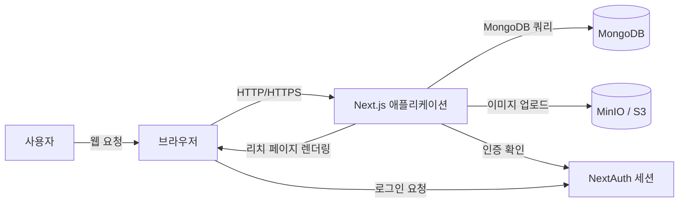
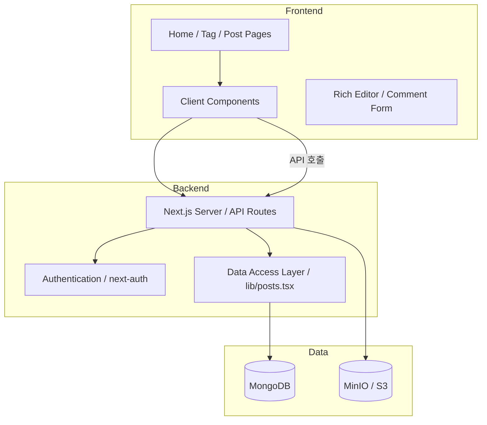
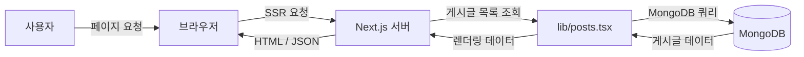

# Architecture Document

## 1. 시스템 개요

Handmade Site는 콘텐츠 작성과 공유에 초점을 둔 웹 플랫폼입니다. Next.js App Router를 기반으로 서버 컴포넌트와 클라이언트 컴포넌트를 혼합한 구조를 사용하고, MongoDB를 데이터 저장소로 사용합니다.

## 2. 아키텍처 스타일

- **모놀리식 웹 애플리케이션**: 프론트엔드와 백엔드가 동일한 Next.js 애플리케이션 내에 존재
- **서버 사이드 렌더링(SSR)**: 주요 페이지는 서버에서 데이터 패칭 후 렌더링
- **클라이언트 측 인터랙션**: 에디터, 무한 스크롤, 토글, 폼 입력 등은 클라이언트 컴포넌트로 처리
- **RESTful API**: `app/api/*` 경로를 통해 기능별 엔드포인트 제공

## 2.1 시스템 컨텍스트 다이어그램

## 2.2 주요 구성 요소 다이어그램

## 2.3 데이터 플로우 다이어그램

## 3. 기술 구성

- 프레임워크: Next.js 15
- 언어: TypeScript
- UI: React 19, Tailwind CSS 4, Sass
- 인증: next-auth
- 데이터베이스: MongoDB + Mongoose
- 리치 에디터: TipTap
- 이미지/파일 업로드: MinIO 또는 S3 호환 저장소
- 알림: react-hot-toast

## 4. 모듈 구조

### 4.1 프론트엔드 라우팅

- `app/page.tsx` - 홈
- `app/post/view/[[...id]]/page.tsx` - 게시글 보기
- `app/post/write/[[...id]]/page.tsx` - 게시글 작성/수정
- `app/tags/page.tsx` - 태그 목록
- `app/tags/[tag]/page.tsx` - 태그별 게시글
- `app/dashboard/*` - 사용자 대시보드
- `app/login/page.tsx` - 로그인

### 4.2 공통 컴포넌트

- `components/navbar.tsx`
- `components/footer.tsx`
- `components/post-item.tsx`
- `components/rich-web-editor/editor.tsx`
- `components/rich-web-editor/viewer.tsx`
- `components/achievement-toast.tsx`

### 4.3 API 모듈

- `app/api/auth/[...nextauth]/route.ts` - 인증
- `app/api/post/route.ts` - 단일 게시글 조회/삭제
- `app/api/posts/route.ts` - 게시글 목록
- `app/api/submit/route.ts` - 게시글 작성/수정
- `app/api/comments/route.ts` - 댓글 관리
- `app/api/tags/route.ts` - 태그 검색
- `app/api/upload/route.ts` - 이미지 업로드
- `app/api/like-dislike/route.ts` - 좋아요/싫어요
- `app/api/user/route.ts` - 사용자 정보
- `app/api/my-achievements/route.ts` - 업적 정보

## 5. 데이터 흐름

### 5.1 게시글 목록

1. 사용자 요청 → `app/page.tsx` 또는 `app/tags/[tag]/page.tsx`
2. 서버 컴포넌트가 `lib/posts.tsx`의 데이터 접근 함수 호출
3. MongoDB에서 게시글 리스트 조회
4. 결과를 클라이언트에 렌더링

### 5.2 게시글 작성

1. 사용자 입력 → 클라이언트 폼 제출
2. `POST /api/submit`로 요청 전송
3. 서버에서 `lib/posts.tsx`를 통해 MongoDB 저장
4. 성공 시 사용자에게 토스트 알림 및 리다이렉트

### 5.3 게시글 상세 및 댓글

1. 상세 페이지 진입 → 서버 컴포넌트가 게시글 조회
2. 댓글은 `app/api/comments`를 통해 동적으로 조회/등록
3. 클라이언트는 댓글 데이터를 비동기로 로드

## 6. 비기능적 설계 고려사항

### 6.1 확장성

- API 엔드포인트가 기능별로 분리되어 있으므로 기능 확장이 쉬움
- Mongoose 모델 확장은 비교적 직접적

### 6.2 유지보수성

- `src/app`, `src/components`, `src/lib`, `src/models`로 분리된 책임
- 재사용 가능한 컴포넌트와 모듈화된 API

### 6.3 성능

- 무한 스크롤 및 페이징이 필요한 목록 페이지 설계
- 이미지 업로드와 데이터 페칭을 비동기 처리

### 6.4 보안

- 인증이 필요한 경로와 API는 `next-auth`로 보호
- 서버 측에서 세션 기반 권한 검증
- 파일 업로드 제한 및 처리 검증 필요

## 7. 아키텍처 제안

### 7.1 권장 개선

- SEO가 중요한 페이지는 `metadata`와 서버 사이드 렌더링을 적극 활용
- 대량 트래픽 시 게시글 목록에 캐시 또는 인덱스 최적화 적용
- 인증/권한 모델을 명확히 분리
- 이미지 업로드에 CDN 적용

### 7.2 문서화

- 이 문서와 함께 데이터베이스 스키마 다이어그램, API 명세서, 컴포넌트 플로우 차트를 추가 문서화 권장
