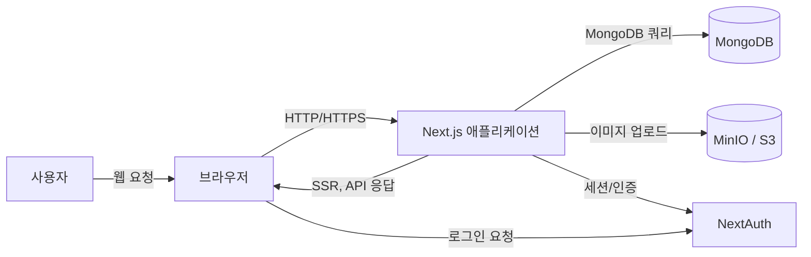
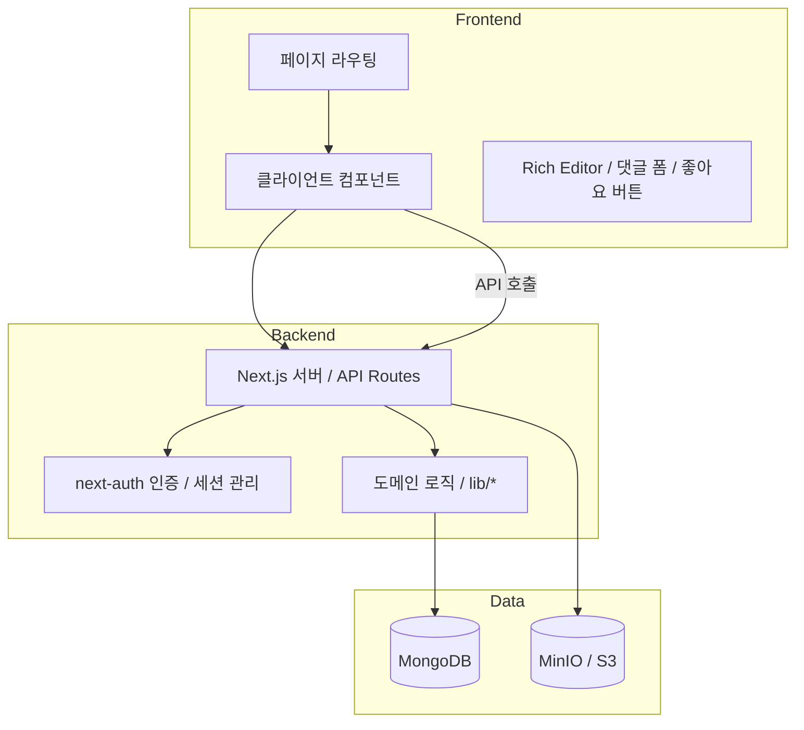

# Architecture Document

## 1. 시스템 개요

Handmade Site는 유머형 콘텐츠 작성과 공유에 초점을 둔 웹 플랫폼입니다. `Next.js App Router` 기반 Monorepo 스타일의 단일 애플리케이션에서 프론트엔드 페이지와 REST API를 함께 제공하며, MongoDB를 데이터 저장소로 사용합니다.

핵심 기능은 게시글 작성/수정, 댓글 작성, 태그 검색, 좋아요/싫어요, 업적 및 포인트 시스템, 이미지 업로드 입니다.

## 2. 아키텍처 스타일

- **모놀리식 웹 애플리케이션**: 프론트엔드와 백엔드가 동일한 Next.js 애플리케이션 내에 존재
- **서버 사이드 렌더링(SSR)**: 대부분 페이지가 서버 컴포넌트로 렌더링되고, 데이터는 서버에서 조회됨
- **클라이언트 측 인터랙션**: 리치 에디터, 댓글 제출, 좋아요/싫어요, 무한 스크롤 등은 클라이언트 컴포넌트로 처리
- **RESTful API**: `src/app/api/*` 경로로 기능별 엔드포인트 제공
- **세션 기반 인증**: `next-auth`를 사용한 Google/GitHub 로그인 및 세션 검증
- **데이터 계층 분리**: `src/lib/*`에 공통 DB 접근 및 도메인 로직 보관

## 3. 시스템 컨텍스트 다이어그램

## 4. 주요 구성 요소 다이어그램

## 5. 데이터 모델 요약

### 5.1 Post
- `title`: string
- `htmlContent`: string
- `jsonContent`: object
- `urls`: Array<{ url: string; thumbnailUrl: string }>
- `author`: string
- `userEmail`: string
- `likes`: number
- `views`: number
- `version`: number
- `tags`: string[]
- `isDeleted`: boolean
- `deletedAt`: Date | null
- `createdAt`, `updatedAt`: timestamps
- 인덱스: `tags`, `isDeleted`
- 저장 방식: soft delete와 버전 관리

### 5.2 Comment
- `post`: ObjectId(`Post`)
- `parent`: ObjectId(`Comment`) | null
- `author`: string
- `authorId`: ObjectId(`User`) | null
- `content`: string
- `likes`: number
- `createdAt`: Date
- `isDeleted`: boolean
- `timestamps`: auto 생성

### 5.3 User
- `username`: string
- `email`: string
- `password`: string | undefined
- `profileImage`: string
- `providers`: string[]
- `achievements`: [{ achievement: ObjectId(`Achievement`); unlockedAt: Date }]
- `settings`: { theme: 'light' | 'dark' | 'system' }
- `points`: number
- `createdAt`, `updatedAt`: timestamps

### 5.4 Achievement
- `key`: string
- `name`: string
- `description`: string
- `icon`: string
- `points`: number

### 5.5 PostRevision
- `postId`: ObjectId(`Post`)
- `title`, `htmlContent`, `jsonContent`, `author`, `userEmail`, `version`, `createdAt`
- 저장 방식: 게시글 수정 시 이전 버전을 기록

## 6. API 설계 및 플로우

### 6.1 인증
- `src/app/api/auth/[...nextauth]/route.ts`
- Google, GitHub OAuth 프로바이더 지원
- `signIn` 콜백에서 MongoDB에 사용자 저장 및 providers 업데이트
- 세션 검증은 `getServerSession(authOptions)` 기반

### 6.2 게시글
- `GET /api/posts?page=&limit=&sort=&email=`: 게시글 목록 조회
- `GET /api/post?_id=...`: 단일 게시글 조회
- `POST /api/submit`: 게시글 작성/수정
  - `payload._id`가 있으면 수정, 없으면 생성
  - 수정 시 `PostRevision`에 이전 버전 저장
  - 생성 시 사용자 포인트 증가 및 업적 검증
- `DELETE /api/post`: 게시글 소프트 삭제
  - 작성자 여부 검증
  - 삭제 시 사용자 포인트 차감
  - 연관 댓글 `isDeleted` 플래그 설정

### 6.3 댓글
- `GET /api/comments?postId=...`: 게시글 댓글 조회
- `POST /api/comments`: 댓글 작성
  - 로그인 사용자: authorId 설정
  - 비로그인 사용자: `anonid`를 변환해 익명 닉네임 생성
  - 작성자 포인트 및 업적 부여
- `DELETE /api/comments`: 댓글 작성자만 soft delete

### 6.4 태그
- `GET /api/tags?q=...`: 태그 자동완성/검색
- `GET /api/tags` (without query): 모든 태그 목록
- `GET /api/tags/[tag]`: 태그별 게시글 목록

### 6.5 업로드
- `POST /api/upload`: 이미지 + 썸네일 업로드
- MinIO 클라이언트를 사용하여 버킷에 저장
- 반환 값: `url`, `thumbnailUrl`

### 6.6 좋아요/싫어요
- `POST /api/like-dislike`: 좋아요/싫어요 카운트 조정
- likes 값은 0 미만으로 내려가지 않도록 처리
- 상호작용 후 업적 검증 호출

### 6.7 사용자 정보
- `GET /api/user/profile`: 현재 사용자 프로필 조회
- `GET /api/user/settings`: 사용자 테마 설정 조회
- `PUT /api/user/settings`: 테마 설정 업데이트
- `GET /api/my-achievements`: 사용자 업적 목록 조회

## 7. 데이터 흐름

### 7.1 게시글 목록 조회
1. `app/page.tsx` 또는 `app/tags/[tag]/page.tsx`가 API 호출 대신 서버 함수로 `lib/posts.tsx` 호출
2. `getPaginatedPosts`가 MongoDB 집계 파이프라인 실행
3. 댓글 수, 조회수, 태그 필터링을 포함한 결과 반환
4. 서버 렌더링된 HTML이 브라우저에 전달됨

### 7.2 게시글 작성/수정
1. 작성 페이지에서 클라이언트가 `POST /api/submit` 호출
2. 서버가 세션 확인 후 payload 유효성 검사
3. 새 게시글 생성 또는 기존 게시글 업데이트
4. 작성 시 포인트 적립, 업적 잠금 해제, 수정 시 이전 버전 `PostRevision` 저장

### 7.3 댓글 작성
1. 클라이언트가 `POST /api/comments` 전송
2. 세션이 없으면 익명 `anonid`로 작성자 표시
3. DB에 댓글 저장
4. 로그인 시 포인트 + 업적 검증

### 7.4 이미지 업로드
1. 클라이언트가 `multipart/form-data` 전송
2. MinIO에 원본/썸네일 업로드
3. 공개 URL을 응답으로 반환

## 8. 기술 구성

- 프레임워크: Next.js 15
- 언어: TypeScript
- UI: React 19, Tailwind CSS 4, Sass
- 인증: next-auth (Google, GitHub)
- DB: MongoDB + Mongoose
- 에디터: TipTap
- 이미지 저장: MinIO / S3 호환 저장소
- 알림: react-hot-toast
- 데이터 접근: `src/lib/db.tsx`, `src/lib/posts.tsx`, `src/lib/achievements.tsx`

## 9. 운영 및 환경

필수 환경 변수:
- `MONGO_URI`
- `NEXTAUTH_SECRET`
- `GOOGLE_CLIENT_ID`, `GOOGLE_CLIENT_SECRET`
- `GITHUB_CLIENT_ID`, `GITHUB_CLIENT_SECRET`
- `MINIO_ENDPOINT`, `MINIO_ACCESSKEY`, `MINIO_SECRETKEY`, `MINIO_BUCKET`
- 선택적: `POINTS_FOR_NEW_POST`, `POINTS_FOR_NEW_COMMENT`, `DELETE_POST_COST`, 업적 포인트 환경 변수

배포 형태:
- Vercel, 자체 Node 서버, Docker 기반 호스팅

## 10. 구현 노트

- 게시글과 댓글은 soft delete를 사용
- 태그 검색은 정규식 기반, 대소문자 무시
- `deletePost`는 포인트 차감 모델을 사용해 삭제 권한을 간접 관리
- `likes` 카운트는 0 미만으로 떨어지지 않도록 쿼리에 방어 로직 포함
- `comments` 조회 시 `isDeleted`인 댓글은 내용이 대체되어 반환됨
- 업적 시스템은 `src/lib/achievements.tsx`에서 정의되고, 사용자 포인트 및 잠금 해제를 자동 처리함

## 11. 추가 권장 사항

- API 문서화를 위해 OpenAPI/Swagger 또는 Postman 컬렉션 생성
- 관리 기능(신고, 콘텐츠 검수) 추가
- 캐시 계층 도입, 업로드 CDN 적용
- 보안 강화: CSRF, 입력값 검증, 업로드 파일 형식 및 크기 제한
- 테스트: 단위 테스트, 통합 테스트, E2E 테스트 계획 수립
