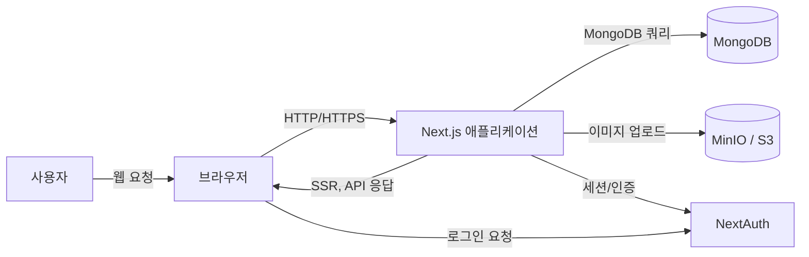
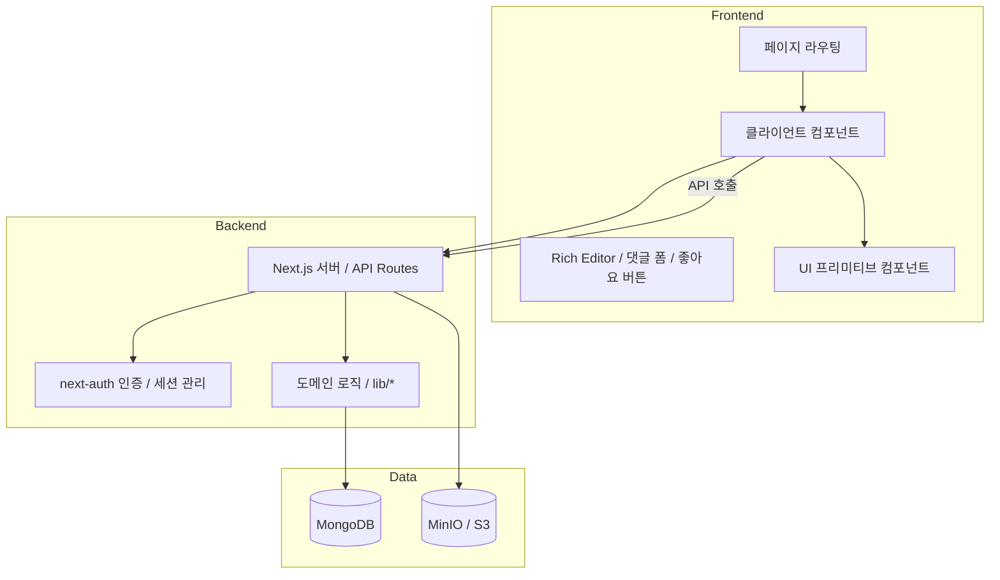

# Architecture Document

## 1. 시스템 개요

Handmade Site는 유머형 콘텐츠 작성과 공유에 초점을 둔 웹 플랫폼입니다. Next.js App Router 기반 단일 애플리케이션에서 프론트엔드 페이지와 REST API를 함께 제공하며, MongoDB를 데이터 저장소로 사용합니다.

핵심 기능: 게시글 작성/수정, 댓글, 태그 검색, 좋아요/싫어요, 업적 및 포인트 시스템, 이미지 업로드.

## 2. 아키텍처 스타일

- **모놀리식 웹 애플리케이션**: 프론트엔드와 백엔드가 동일한 Next.js 애플리케이션 내에 존재
- **서버 사이드 렌더링(SSR)**: 대부분 페이지가 서버 컴포넌트로 렌더링되고, 데이터는 서버에서 조회됨
- **클라이언트 측 인터랙션**: 리치 에디터, 댓글 제출, 좋아요/싫어요, 무한 스크롤 등은 클라이언트 컴포넌트로 처리
- **RESTful API**: `src/app/api/*` 경로로 기능별 엔드포인트 제공
- **세션 기반 인증**: `next-auth`를 사용한 Google/GitHub 로그인 및 세션 검증
- **데이터 계층 분리**: `src/lib/*`에 공통 DB 접근 및 도메인 로직 보관

## 3. 시스템 컨텍스트 다이어그램

## 4. 주요 구성 요소 다이어그램

데이터 모델, API 설계, 데이터 흐름 상세는 [SDS.md](SDS.md)를 참조.

## 5. 기술 구성

| 분류 | 기술 |
|---|---|
| 프레임워크 | Next.js 15, React 19 |
| 언어 | TypeScript (경로 별칭 `@/*` → `src/*`) |
| 스타일 | Tailwind CSS 4, Sass, clsx, tailwind-merge |
| 인증 | next-auth v4 (Google, GitHub OAuth) |
| DB | MongoDB + Mongoose |
| 에디터 | TipTap v2 |
| 이미지 저장 | MinIO (S3 호환) |
| 알림 | react-hot-toast |
| 테스트 | Vitest (경로 별칭 `@/*` 지원, `vitest.d.ts`로 전역 타입 선언) |

## 6. 디자인 시스템

`src/components/ui/`에 재사용 가능한 UI 프리미티브 컴포넌트를 관리한다.

### 컴포넌트

| 컴포넌트 | 파일 | 주요 props |
|---|---|---|
| Button | `button.tsx` | `variant` (primary/secondary/ghost/danger), `size` (sm/md/lg) |
| Card | `card.tsx` | `padding` (none/sm/md/lg) |
| Input | `input.tsx` | `error` (boolean) |
| Badge | `badge.tsx` | `variant` (default/primary/success/warning/danger) |

### 설계 원칙
- **variant 설정 분리**: `button.variants.ts`, `badge.variants.ts`에 순수 TS 객체로 분리 → JSX 없이 단위 테스트 가능
- **클래스 병합**: `src/lib/cn.ts` (`clsx` + `tailwind-merge`) — `className` props override 시 충돌 없이 병합
- **디자인 토큰**: `src/app/globals.css` `@theme inline`에 brand 색상(`--color-brand-*`)과 `shadow-card` 토큰 추가

## 7. 운영 및 환경

필수 환경 변수:
- `MONGO_URI`
- `NEXTAUTH_SECRET`
- `GOOGLE_CLIENT_ID`, `GOOGLE_CLIENT_SECRET`
- `GITHUB_CLIENT_ID`, `GITHUB_CLIENT_SECRET`
- `MINIO_ENDPOINT`, `MINIO_ACCESSKEY`, `MINIO_SECRETKEY`, `MINIO_BUCKET`
- `NEXT_PUBLIC_SITE_URL` — 정규 URL 및 OG 메타태그 기준 (`https://your-domain.com`)
- 선택적: `POINTS_FOR_NEW_POST`, `POINTS_FOR_NEW_COMMENT`, `DELETE_POST_COST`, 업적 포인트 환경 변수

배포 형태: Vercel, 자체 Node 서버, Docker 기반 호스팅

## 8. 구현 노트

- **Soft delete**: 게시글과 댓글은 `isDeleted` 플래그로 처리. 삭제된 댓글은 내용이 "삭제된 댓글입니다"로 대체되어 반환.
- **게시글 버전 관리**: 수정 시 이전 버전을 `PostRevision` 컬렉션에 저장. `version` 필드로 이력 추적. 목록 조회 API(`GET /api/post/revisions?postId=`) 제공.
- **에디터 저장 형식**: TipTap 에디터는 `htmlContent`(렌더링용)와 `jsonContent`(재편집용) 두 형식을 함께 저장.
- **무한 스크롤**: `IntersectionObserver`로 페이지 하단 감지. 동일 옵저버로 최상단 노출 게시글도 추적.
- **이미지 업로드**: 클라이언트에서 `browser-image-compression`으로 압축 후 `multipart/form-data`로 전송. MinIO에 원본과 썸네일을 함께 저장.
- **태그 검색**: 대소문자 무시 정규식(`$regex`, `$options: 'i'`) 기반. 태그 클라우드 폰트 크기는 0.95~2.15rem 범위로 정규화. 긴 태그명은 `break-all`로 줄바꿈 처리.
- **익명 댓글 ID**: `nanoid`로 생성된 ID를 base-5 인코딩하여 익명 닉네임 표시.
- **좋아요 카운트**: `likes`는 0 미만으로 떨어지지 않도록 쿼리에 방어 로직 포함.
- **포인트 삭제 비용**: 게시글 삭제 시 포인트 차감으로 삭제에 간접 비용 부여.
- **다크 모드**: 시스템 테마(`@media (prefers-color-scheme: dark)`) 기반. `layout.tsx`의 `DarkClassSync` 컴포넌트가 미디어 쿼리 변화를 감지해 `<html class="dark">`를 동기화 — TipTap이 `.dark` 클래스 기반 자체 CSS 변수를 사용하기 때문. Tailwind `dark:` 유틸리티 클래스로 컴포넌트 스타일 적용.
- **카드 본문 프리뷰**: 목록에서 카드 토글 또는 내가 올린 유머 카드에서 `RichContentViewer`로 본문 일부 표시. `max-h` + `overflow-hidden` + gradient fade 패턴. `PostContentPreview` 컴포넌트(`ssr: false`)로 재사용.
