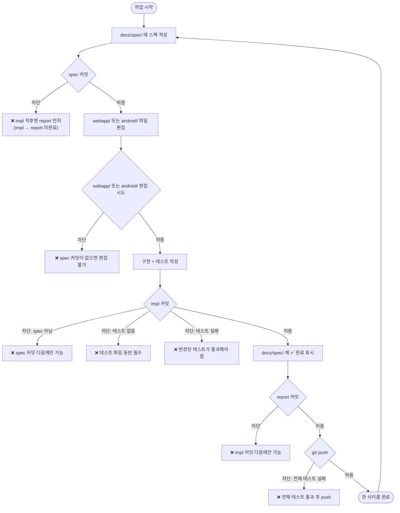
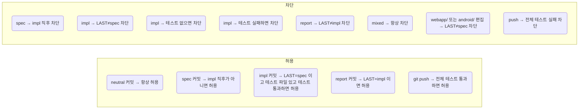

# Claude Code 훅 시스템

Claude Code가 파일을 편집하거나 git 커밋/push를 실행하기 전에 자동으로 실행되는 가드 스크립트 모음입니다.
`.claude/settings.json`에 등록되어 있으며, 실제 로직은 `.claude/hooks/`에 분리되어 있습니다.

---

## 전체 흐름



---

## 커밋 타입 판별 기준

훅은 커밋 메시지 prefix가 아니라 **스테이징된 파일 위치**로 타입을 판별합니다.

| 타입 | 조건 |
|------|------|
| `neutral` | `webapp/` 도 `android/` 도 `docs/spec/` 도 없음 |
| `spec` | `docs/spec/` 만 있고, 추가된 줄에 `✅` 없음 |
| `impl` | `webapp/` 또는 `android/` 만 있음 |
| `report` | `docs/spec/` 만 있고, 추가된 줄에 `✅` 있음 |
| `mixed` | (`webapp/` 또는 `android/`) + `docs/spec/` 혼재 → 항상 차단 |

`neutral` 커밋(`chore:`, `fix:` 등 설정·문서 변경)은 순서 검증 없이 항상 허용됩니다.

테스트 파일 판별 기준:
- **webapp**: `*.test.ts`, `*.test.tsx` 등 파일명에 `.test.` 포함
- **android**: `src/test/` 또는 `src/androidTest/` 디렉터리 내 파일

---

## 상태 판단 방식

직전 커밋 1개가 아닌, **최근 100개 커밋 중 마지막 워크플로우 커밋**을 기준으로 현재 상태를 판단합니다.
중립 커밋이 중간에 끼어도 흐름이 끊기지 않습니다.

```
spec → chore(중립) → impl   ← 허용 (LAST = spec)
spec → chore(중립) → spec   ← 허용 (LAST = spec이 아님, spec은 impl 직후가 아니면 OK)
```

---

## 허용 / 차단 규칙 요약



---

## 스크립트 목록

| 파일 | 이벤트 | 역할 |
|------|--------|------|
| `check-git-add-commit.sh` | `Bash(*git*commit*)` | `git add && git commit` 한 줄 실행 차단 |
| `check-commit-sequence.sh` | `Bash(*git*commit*)` | spec → impl → report 순서 강제, impl 시 테스트 실행 |
| `check-src-edit.sh` | `Edit`, `Write` | `webapp/` 또는 `android/` 편집은 spec 커밋 이후에만 허용 |
| `check-push-tests.sh` | `Bash(*git*push*)` | push 전 전체 테스트 스위트 실행 |

---

## 스펙 파일 관리 원칙

**피처 파일에 섹션 추가** 방식을 사용한다.

- 하나의 피처에 속하는 변경(sub-feature, 결정사항, 기각된 접근법 포함)은 **같은 파일에 섹션(`---`)으로 추가**한다
- 완전히 독립된 피처만 새 파일을 만든다
- 이렇게 하면 파일 수를 줄이고, 관련 컨텍스트를 한 파일에서 파악할 수 있다

예시:
```
quest-editor-multi-select.md   ← 기본 구현 + 노드 하이라이트 + UX 결정 모두 여기
quest-editor-save-version.md   ← 독립 피처라 별도 파일
```

---

## 탈출 수단

상태가 꼬인 경우 빈 spec 커밋으로 사이클을 리셋할 수 있습니다.

```bash
git commit --allow-empty -m "spec: 상태 리셋"
```

---

## 알려진 한계

- Claude Code 밖에서 직접 `git commit`을 실행하면 훅이 작동하지 않습니다.
- `git rebase`, `git cherry-pick` 중에는 훅이 예상과 다르게 동작할 수 있습니다. 리베이스 완료 후에는 git log 기반으로 자가복구됩니다.
- 100개 이내에 워크플로우 커밋이 없으면 LAST=none으로 판단해 허용적으로 동작합니다.
